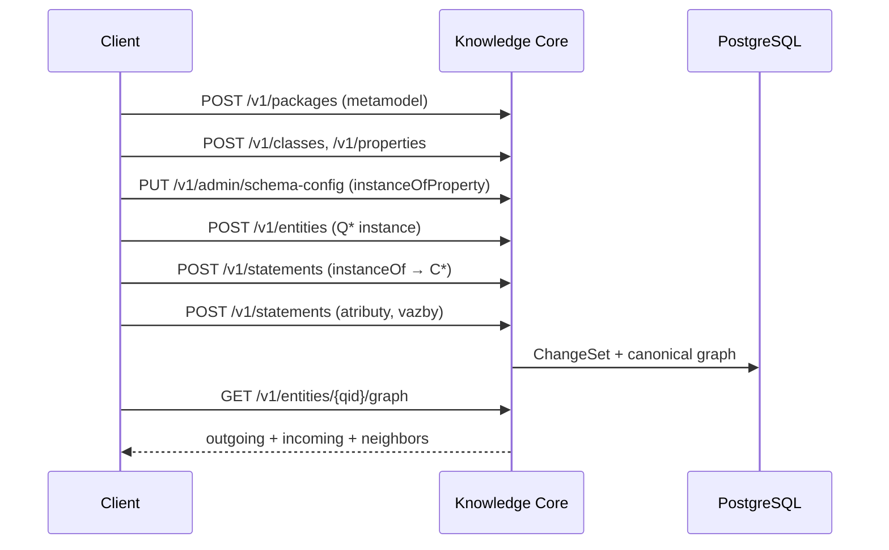

# Koncepty pro integraci

Tento dokument vysvětluje, **jak Knowledge Core funguje z pohledu klientské aplikace**. Normativní detaily jádra: [technický návrh](../design/knowledge_core_v1_technicky_navrh.md).

## Co KC je a není

**Je:**

- Canonical store pro knowledge graph (entity + tvrzení)
- Open-world doménový model — nové typy a vazby bez SQL migrace
- Verzování metamodelu přes packages a immutable releases
- HTTP API pro CRUD grafu, schema objektů, lenses a projekcí

**Není:**

- Ontologie nebo doménový engine (ArchiMate, BPMN, …) — to je **obsah packages**
- SPARQL/OWL reasoner (RDF export je odvozená projekce)
- Workflow engine ani obecné scriptování v lens definicích

Doménová pravidla (matice vazeb, enumy, mapování do XML) implementuje **klientský nástroj** nad daty v package — KC je obecný graf s volitelnou validací shapes.

## Čtyři vrstvy

```text
┌─────────────────────────────────────────────────────────┐
│ 4. Projections — search, RDF export (odvozené, rebuild) │
├─────────────────────────────────────────────────────────┤
│ 3. Software — Go služba, lens engine, auth              │
├─────────────────────────────────────────────────────────┤
│ 2. Model repository — packages, C*/P*, shapes, lenses   │
├─────────────────────────────────────────────────────────┤
│ 1. Knowledge graph — Q* entity, S* statements           │
└─────────────────────────────────────────────────────────┘
         Source of truth = PostgreSQL (vrstvy 1 + 2)
```

Klientská aplikace typicky:

1. Definuje **metamodel** v package (třídy, properties, tvary)
2. Vytváří **instance** v dalších packages (entity + statementy)
3. Čte graf přes REST nebo domain lens
4. Publikuje **release** metamodelu pro promotion mezi prostředími

## Identita

| Objekt | Public ID | Stabilní mezi instalacemi |
|--------|-----------|---------------------------|
| Entita | `Q<n>` | Ne — liší se per instalace |
| Property | `P<n>` | Ne |
| Class | `C<n>` | Ne |
| Statement | `S<n>` | Ne |
| Reference | `R<n>` | Ne |

**Stabilní identita ve slovníku** = `iriLocal` v rámci package + `package.iriBase`.

Kanonické IRI = `iriBase` + `iriLocal` (např. `https://example.org/my-model/ApplicationComponent`).

> Veřejná ID (`Q12`, `P7`) se **nikdy nerecyklují**. Label není identita — je to prezentační metadata.

## Entity, třídy a properties

Všechny tři druhy jsou **entity** v datastore. Rozdíl je v profilu:

| Druh | Public ID | Profil | Typický účel |
|------|-----------|--------|--------------|
| Obyčejná entita | `Q*` | — | Instance doménových objektů |
| Property | `P*` | `property_profile` | Datatype, constraints |
| Class | `C*` | `class_profile` | Typ entity, `subClassOf` |

Typing instance: statement na property **`instanceOf`** (globální schema-config) → hodnota `EntityReference` na `C*`.

Schema kontrakt (datatype, `rangeClasses`, `subClassOf`) žije v **profilu**, ne v obyčejných statementech na entitě.

## Statement

First-class tvrzení:

```text
subject (Q/P/C) + property (P*) + typed value + status
  + volitelně: qualifiers, references, validFrom/validTo, packageCode
```

Důležité invarianty:

- Duplicitní `(subject, property, value)` je **povoleno** (nebo použij `upsert: true`)
- Mutace jen explicitně: create, revise, deprecate, delete
- Každá mutace = atomický **ChangeSet** (audit)

## Label a popis

`labels.en` je **povinné** u pojmenovaných objektů (entity, property, class, package).  
Label **není** statement — je systémové prezentační metadata.

## Package a Release

**Package** = vlastnická a verzovací jednotka. Vlastní entity, properties, classes, statementy a shapes.

- Cross-package reference je povolená (Keycloak v `platform`, CRM v `sys-crm`)
- `lifecycle`: `released` (default) nebo `continuous`
- Závislosti: `{ dependsOnCode, versionRange }` (SemVer ranges)

**Release** = immutable snapshot package (+ dependency closure). Export/import jako **bundle** pro promotion DEV → TEST → PROD.

Revision (optimistic lock na entitě) ≠ Release (verze metamodelu).

## Typická struktura packages

```text
my-domain/          ← metamodel (třídy, P*, shapes, policy data)
sys-crm/            ← instance jednoho systému
sys-erp/
platform/           ← sdílené závislosti (IdP, DNS, …)
```

Referenční příklad: package `archimate-lite` (metamodel) + `sys-*` (instance systémů).

## Lens (domain API)

Deklarativní mapování graph ↔ domain objekt s field names místo Q/P.

```text
GET  /v1/lenses/{code}/instances/{key}       → { "name": "CRM", "owner": { … } }
POST /v1/lenses/{code}/instances/{key}/patch → { "operations": [{ "op": "set", … }] }
```

Lens **není** security boundary, ontologie ani executable kód.  
Write operace: `set`, `clear`, `add`, `remove`.

Kdy použít lens vs. přímý graph API — viz [client-guide.md](client-guide.md#volba-api).

## Authorization

Centrální engine, default **deny**. RBAC + omezený ABAC přes `auth_policy`.

| Režim | Použití |
|-------|---------|
| `bootstrap` | Po instalaci — heslo = plná práva |
| `dev` | Lokální vývoj — `X-Subject` + `X-Roles` |
| `oidc` | Produkce — JWT bearer token |

Provenance (kdo/kdy změnil tvrzení) ≠ audit (ChangeSet) ≠ ACL metadata.

## Projections

Odvozené read modely — **nejsou** source of truth:

- **Search** — full-text, ACL-aware (`GET /v1/projections/search`)
- **RDF** — N-Triples export (`GET /v1/projections/rdf`)

Rebuild kdykoliv z canonical dat. Klientský nástroj je může použít pro analýzu, ne pro zápis.

## Čas

| Typ | Význam |
|-----|--------|
| Transaction time | Kdy ChangeSet commitnul (audit, historie) |
| Valid time | Volitelný interval platnosti tvrzení ve světě (`validFrom`/`validTo`) |

## Validace

KC nabízí volitelnou validaci při zápisu (`X-Validation-Mode`):

| Režim | Chování |
|-------|---------|
| `relaxed` (default) | Zápis projde, findings v odpovědi |
| `strict` | Zápis selže při error-level finding |
| `off` | Bez validace |

**Shapes** definují požadované properties na instanci třídy.  
Doménová pravidla nad daty v package (matice vazeb, enumy) implementuje klientský nástroj.

## Diagram: vytvoření instance



Další krok: [client-guide.md](client-guide.md).
